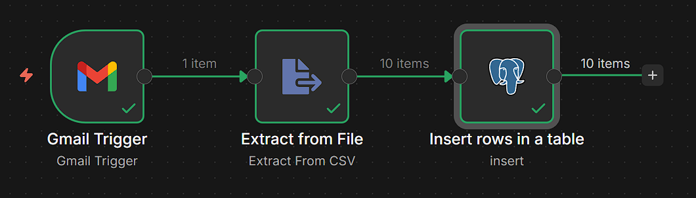

# Sales Data Automation (Gmail -> Supabase)

## Project Overview
This project automates the extraction of sales transaction data from Gmail attachments and syncs it into a Supabase (PostgreSQL) database using n8n.

## Architecture
- **Trigger:** Gmail (New message with "sales" in subject)
- **Transform:** n8n "Extract from File" (Binary to JSON conversion)
- **Load:** Supabase / Postgres (Insert row)

## Tech Stack
- **Orchestration:** n8n
- **Database:** Supabase (PostgreSQL)
- **Infrastructure:** Cloud-native / Serverless

## Setup Instructions
1. **Database:** Execute the SQL script in `/database/table_schema.sql` within your Supabase SQL editor.
2. **n8n:** Import the `.json` file from the `/workflow` folder.
3. **Credentials:** Set up Gmail OAuth2 and Supabase Postgres connection in n8n.

## Future Improvements
- Implement an **Upsert** logic to avoid duplicate Order IDs.
- Add an **Error Trigger** to send notifications if an ingestion fails.
